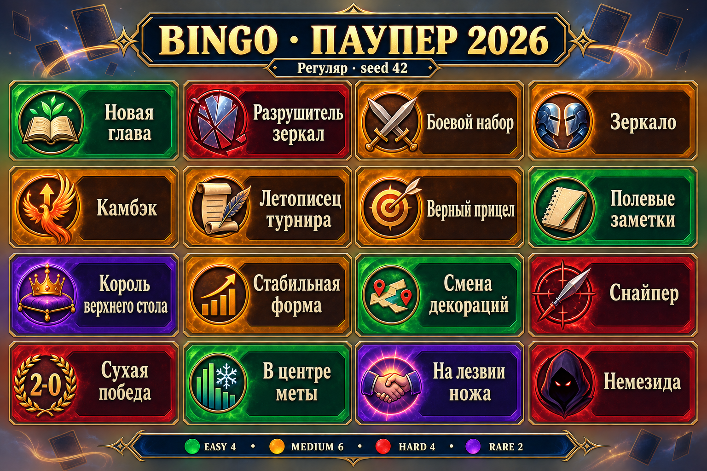
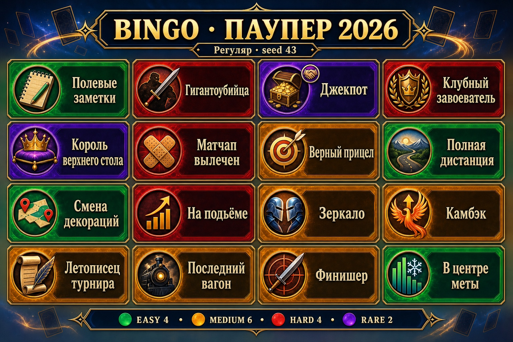
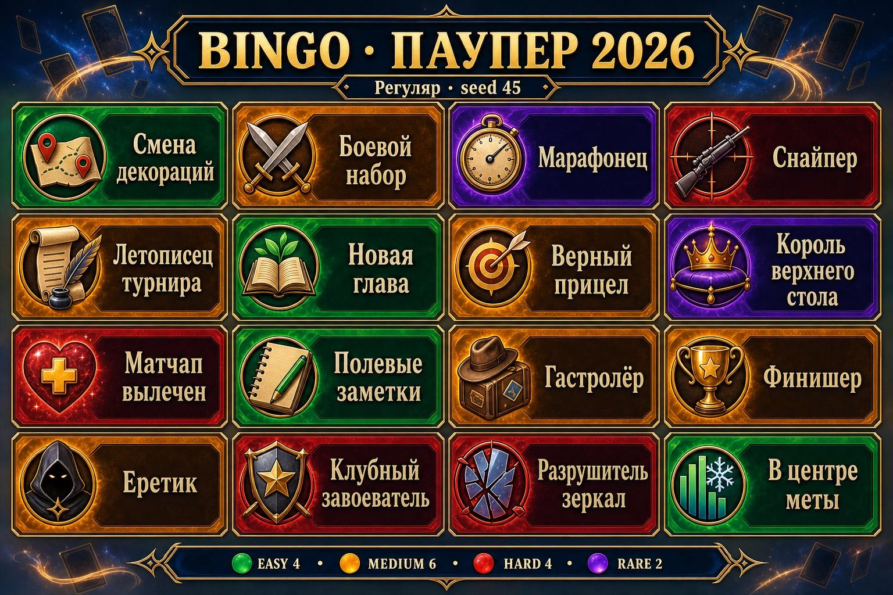

# Bingo generator: preview contract

Первый кодовый slice issue [#213](https://github.com/mmbabaev/MetaTheGathering/issues/213)
реализует этапы A–B: versioned manifest, конкретные candidates, fixture-каталог и
детерминированный pure generator. Здесь ещё нет БД, Season/Board/Cell, Board Lab route,
player UI, сохранения completion events или prize claims.

## Поток данных

```text
AchievementTypeManifest
  -> параметризация для season + player
  -> InstantiatedCandidate (frozen params + eligibility)
  -> generate_board(..., seed, constraints)
  -> BoardDraft (16 cells + reproducible input + diagnostics)
```

Контракты находятся в `services/achievements/bingo/models.py`, solver — в
`generator.py`, pure-параметризаторы — в `parameterizers.py`, временный каталог для
четырёх fairness-personas — в `fixtures.py`.

## Инварианты v1

- размер 4×4 и квоты `4 easy / 6 medium / 4 hard / 2 rare`;
- в каждом горизонтальном ряду минимум одна easy и один маршрут без требования
  высокого baseline-винрейта;
- максимум одна rare и одна peer-confirmed клетка на ряд;
- максимум две peer-confirmed клетки на поле;
- один конкретный opponent не встречается больше одного раза;
- одна mechanic не дублируется под разными candidate IDs;
- incompatibilities и `max_per_board` проверяются до добавления клетки;
- candidate с `eligible=false`, `idea` или `data_blocked` не попадает на поле и остаётся
  в diagnostics с reason/fallback;
- невозможный pool завершает ограниченный backtracking с `BoardGenerationError`, а не
  уходит в случайный reroll.

Алгоритм использует SHA-256 ranking от `algorithmVersion + catalogVersion + seasonId +
playerId + seed`. Порядок candidates на входе не влияет на результат. `BoardDraft.stable_json()`
возвращает canonical JSON, а input содержит fingerprint полного candidate pool.

## Fixture-каталог

`PREVIEW_MANIFESTS` содержит больше 20 механик из #200/#214 со статусом
`ready_for_preview`. `fixture_candidates()` параметризует их для четырёх профилей:
новичок, любитель, регуляр и про. У новичка stats/H2H candidates без baseline явно
отклоняются; database fallback остаётся в пуле той же сложности.

Версия `board-lab-fixtures-v2` добавила production-shaped механику `play_deck` из
[#200](https://github.com/mmbabaev/MetaTheGathering/issues/200). Она превращает frozen
top-deck catalog в несколько конкретных candidates с одной mechanic: каждая клетка хранит
`statsSnapshotId`, точную `deckGeneralName`, rank и размер baseline, а игрок видит ручное
флейворное название и условие «Сыграй турнир на колоде X». Solver может выбрать один из
вариантов, но не поставит два `play_deck` на одно поле. Pure completion evaluator сравнивает
только canonical `general_name`; пользовательский display name не засчитывается как скрытая
эвристика. Пустой catalog создаёт auditable rejected candidate с reason
`no_frozen_deck_targets` и fallback на `try_new_deck`, а не исчезает из diagnostics молча.

Версия `board-lab-fixtures-v3` обновляет три preview-цели по read-only production snapshot
с правой невключительной границей `2026-08-19` и окном 365 дней. В выборку вошли только
закрытые турниры с полными результатами: 19 из 56 просмотренных (34 исключены как
неполные, 3 — как незакрытые). Тот же порядок получился на окнах 120 и 180 дней, потому
что все подходящие данные находятся внутри последних 120 дней.

| Место | `general_name` | Участия | Игроки | Preview-клетка |
|---:|---|---:|---:|---|
| 1 | Blue Terror | 46 | 27 | Хитрый уж |
| 2 | Grixis Affinity | 36 | 20 | Родство с металлом |
| 3 | Jund Midrange | 29 | 15 | Мосты не горят |
| 4 | Red Rally | 28 | 10 | И грянул рог |
| 5 | Spy Walls | 25 | 7 | У стен есть глаза |
| 6 | Red Madness | 23 | 17 | Вспыльчивый нрав |
| 7 | BG Gardens | 22 | 9 | Цветы зла |
| 8 | White Aggro | 22 | 17 | Следствие ведут двое |
| 9 | Flicker Tron | 20 | 6 | Стена всё помнит |
| 10 | Bogles | 19 | 10 | Броня крепка |

Версия `board-lab-fixtures-v4` расширяет preview-pool с первых трёх строк на весь top-10.
Kuldotha Red и Broodscale Combo остаются удалёнными как не входящие в актуальную десятку.
Таблица аудирует fixture-решение, но не заменяет frozen snapshot первого production-сезона.

Названия опираются на сигнатурные карты и игру колод, а не только на имя архетипа:
«Хитрый уж» — Cryptic Serpent из Blue Terror; «Мосты не горят» — Cleansing Wildfire
по собственным неразрушимым artifact bridges в Jund; «Родство с металлом» — механика
Affinity и металлическая основа Grixis. Остальная семёрка продолжает тот же принцип:
Rally at the Hornburg; Balustrade Spy; Fiery Temper; жертвенные растения Khalni Garden;
пара Thraben Inspector / Novice Inspector; цикл Mnemonic Wall / Ghostly Flicker;
Ethereal Armor и Ancestral Mask на hexproof-существе.

Fixtures нужны только для Board Lab и fairness-тестов. Они не являются утверждённым pool
первого сезона и не должны активироваться как production boards. Перед activation нужны
решения #215, frozen stats provider #211 и persistence/events/claims #212.

## Telegram preview для owner/admin

Команда `/bingo_preview [профиль] [seed]` даёт первый read-only интерфейс к generator:

- профили: `newcomer/новичок`, `amateur/любитель`, `regular/регуляр`, `pro/про`;
- без seed создаётся новый пример, явный seed воспроизводит то же поле;
- бот отвечает только инициатору красивой PNG-сеткой 4×4 и отдельным текстом всех
  16 названий/условий;
- команда доступна только owner/admin и управляется feature flag `achievementBoardLab`;
- БД achievement progress/boards не меняется, DM другим игрокам и сообщения в клубные
  чаты не отправляются.

Примеры: `/bingo_preview`, `/bingo_preview новичок`, `/bingo_preview regular 42`.
Это лёгкая часть Board Lab: управление pool/quotas, реальные игроки, batch diagnostics,
JSON export и сохранение draft остаются в #213.

Пример preview-поля каталога v1 для персоны «Регуляр», seed `42`:



Дополнительные варианты той же персоны с другими seeds:






## Проверка

```bash
python3 -m pytest tests/test_achievement_bingo_generator.py -q
```

Тесты строят 100 seeds для каждой из четырёх personas, проверяют квоты/ряды,
детерминированность, независимость от входного порядка, no-data diagnostics, конкретную
параметризацию/проверку `play_deck` и явную ошибку для невыполнимого pool.
