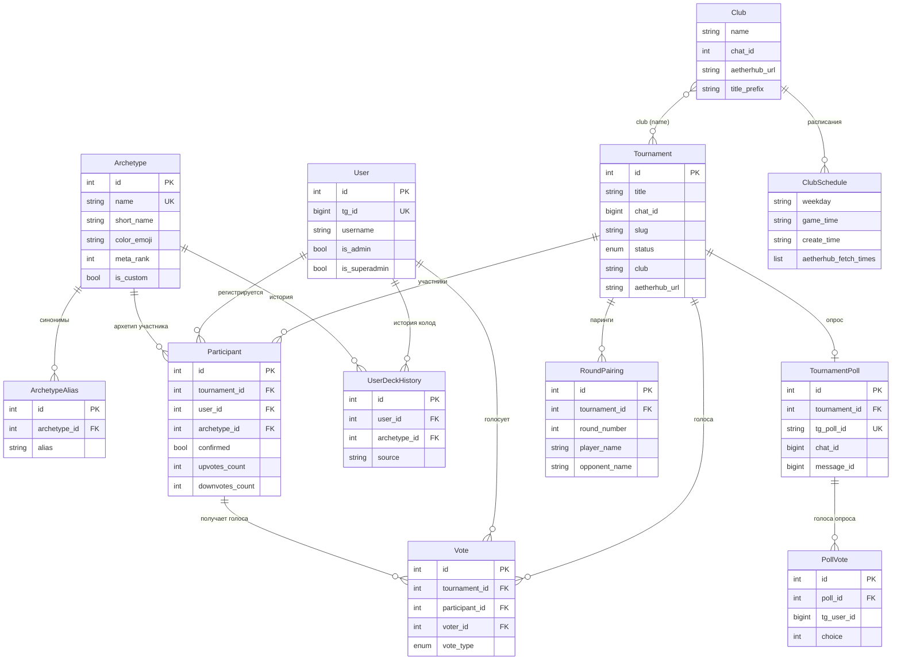

# ER Diagram

```mermaid
erDiagram
    User {
        int id PK
        bigint tg_id UK
        string username
        bool is_admin
        bool is_superadmin
    }

    Tournament {
        int id PK
        string title
        bigint chat_id
        string slug
        enum status
        string club
        string aetherhub_url
    }

    Archetype {
        int id PK
        string name UK
        string short_name
        string color_emoji
        int meta_rank
        bool is_custom
    }

    ArchetypeAlias {
        int id PK
        int archetype_id FK
        string alias
    }

    Participant {
        int id PK
        int tournament_id FK
        int user_id FK
        int archetype_id FK
        bool confirmed
        int upvotes_count
        int downvotes_count
    }

    Vote {
        int id PK
        int tournament_id FK
        int participant_id FK
        int voter_id FK
        enum vote_type
    }

    UserDeckHistory {
        int id PK
        int user_id FK
        int archetype_id FK
        string source
    }

    TournamentPoll {
        int id PK
        int tournament_id FK
        string tg_poll_id UK
        bigint chat_id
        bigint message_id
    }

    PollVote {
        int id PK
        int poll_id FK
        bigint tg_user_id
        int choice
    }

    RoundPairing {
        int id PK
        int tournament_id FK
        int round_number
        string player_name
        string opponent_name
    }

    Club {
        string name
        int chat_id
        string aetherhub_url
        string title_prefix
    }

    ClubSchedule {
        string weekday
        string game_time
        string create_time
        list aetherhub_fetch_times
    }

    Club ||--o{ ClubSchedule : "расписания"
    Club }o--o{ Tournament : "club (name)"

    Tournament ||--o{ Participant : "участники"
    Tournament ||--o{ Vote : "голоса"
    Tournament ||--o| TournamentPoll : "опрос"
    Tournament ||--o{ RoundPairing : "паринги"

    User ||--o{ Participant : "регистрируется"
    User ||--o{ Vote : "голосует"
    User ||--o{ UserDeckHistory : "история колод"

    Archetype ||--o{ Participant : "архетип участника"
    Archetype ||--o{ ArchetypeAlias : "синонимы"
    Archetype ||--o{ UserDeckHistory : "история"

    TournamentPoll ||--o{ PollVote : "голоса опроса"
    Participant ||--o{ Vote : "получает голоса"
```
