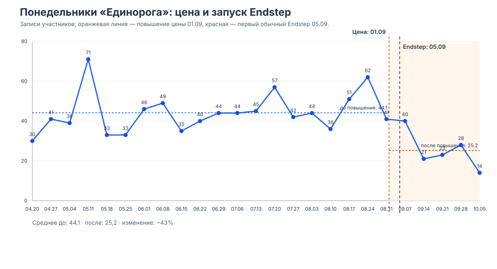
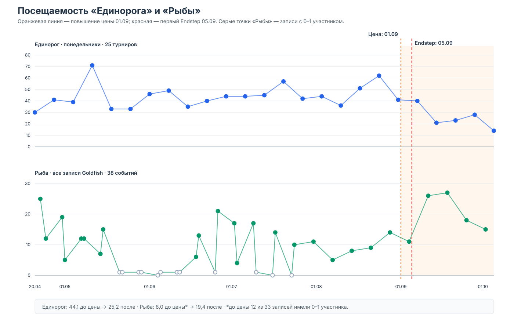
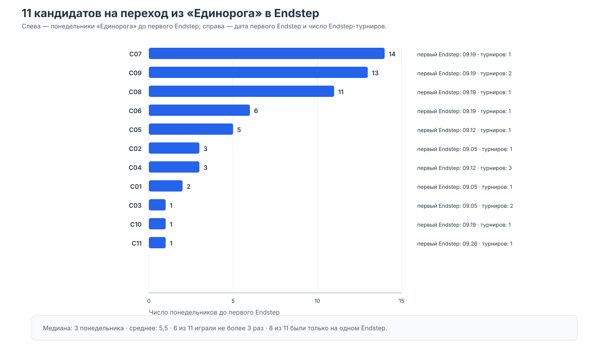
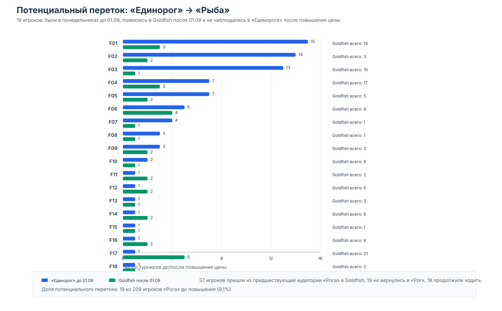

# Финальная презентация: куда ушла аудитория «Единорога»?

Срез: 20.04–05.10.2026 · повышение цены — 01.09.2026 · первый Endstep — 05.09.2026

## Слайд 1. Главный вопрос

Перестали ли игроки московского «Единорога» ходить по понедельникам, перейдя в
Endstep или Goldfish?

## Слайд 2. Итог в одном экране

- Массового перехода в Endstep не видно: 28 из 76 игроков Endstep когда-либо
  встречались в понедельниках «Единорога».
- 11 человек выглядят как кандидаты на переход из «Рога» в Endstep, но у 8 из
  них был только один онлайн-турнир.
- Отдельный маршрут «Рог → Рыба»: 19 потенциальных случаев из 209 прежних
  участников «Рога» — 9,1%.
- Goldfish после 01.09 не просел: среднее по записям выросло с 8,0 до 19,4.

## Слайд 3. Как считали

- Игрок — стабильный `user_id`, а не имя или username.
- «Игрок из Москвы» — прокси через участие в понедельниках «Единорога», потому
  что поле города заполнено неполно.
- Сравнивались записи участников турниров; для старых событий это не всегда
  равно подтверждённому факту игры.
- «Стилёк х Концеход» вынесен отдельно: на момент среза была только регистрация.

## Слайд 4. Посещаемость «Единорога»

Среднее до повышения цены — 44,1, после — 25,2 (−43%). Но цена 01.09 и
первый Endstep 05.09 почти совпали.

## Слайд 5. Цена или Endstep?

- 31.08: 41 участник.
- 07.09: 40 участников — немедленного обвала нет.
- Затем: 21, 23, 28 и 14 участников.
- Последние 4 турнира до повышения: 47,5 в среднем; первые 4 после: 28,0.

Вывод: возможен отложенный эффект цены, но вклад цены и Endstep разделить нельзя.

## Слайд 6. Контроль: Goldfish

В Goldfish наблюдается обратная картина: после 01.09 средняя посещаемость выше.
До повышения есть 12 записей с 0–1 участником, поэтому сырые средние нужно
читать осторожно.

## Слайд 7. 11 кандидатов на переход в Endstep

- Медиана посещений «Единорога» до первого Endstep — 3.
- 5 из 11 были регулярными игроками: 5+ понедельников.
- 8 из 11 посетили только один Endstep.
- Поэтому это кандидаты для проверки, а не доказанные мигранты.

## Слайд 8. Отдельно: «Рог → Рыба»

- 209 игроков участвовали в «Роге» до 01.09.
- 37 из них появились в Goldfish после 01.09.
- 18 продолжили ходить в оба клуба.
- 19 не наблюдались в «Роге» после 01.09 — 9,1% прежней аудитории.

Это наиболее явный сигнал перетока, но не доказательство причинной миграции.

## Слайд 9. Финальный вывод

1. Endstep не забрал массово понедельничную аудиторию «Единорога».
2. После повышения цены «Единорог» просел, но одновременно стартовал Endstep.
3. Goldfish в тот же период не просел, поэтому падение не выглядит общим для всех
   московских дейликов.
4. Потенциальный маршрут «Рог → Рыба» есть, но его масштаб — около 9%, причём
   большая часть случаев редкие.

Следующий шаг: ещё 2–3 месяца наблюдений, факт реальной игры вместо регистрации
и сравнение клубов по одной и той же недельной панели игроков.
